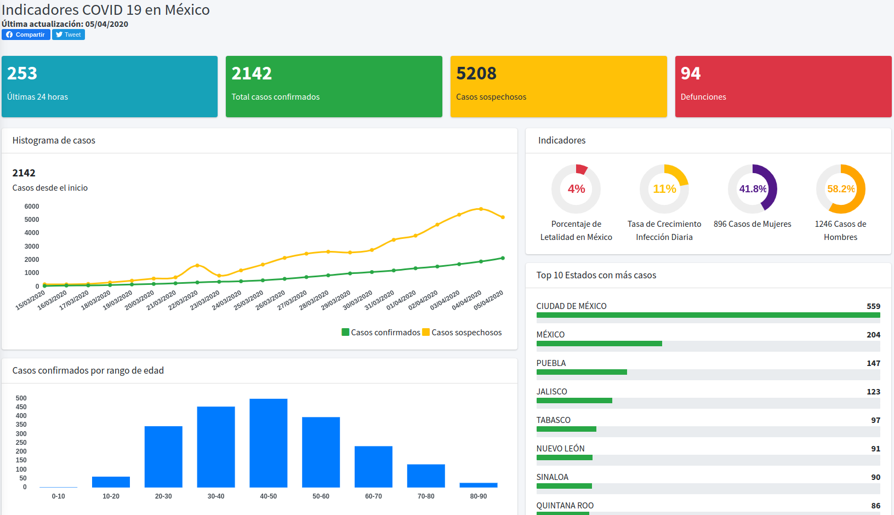
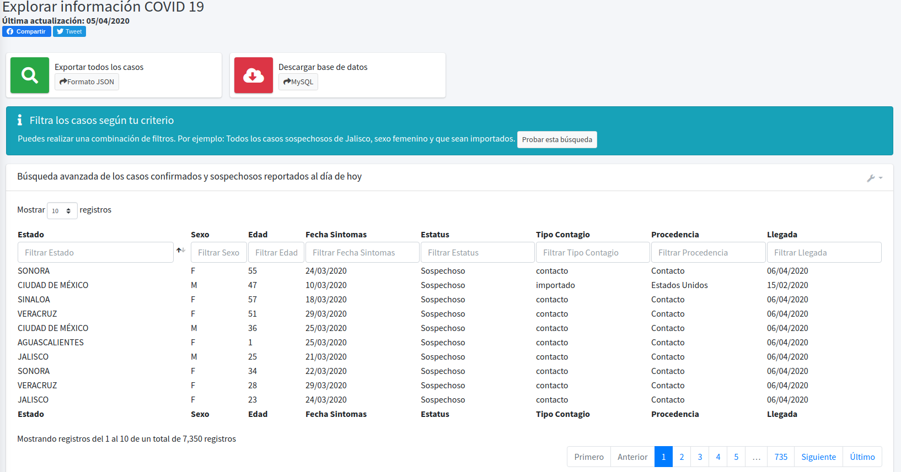

# covidmex
Sitio con estadisticas del Coronavirus (COVID-19) en México. Información extraida desde el comunicado Técnico Diario de la Dirección General de Epidemiología de la  Secretaría de Salud.

# Live Data
Ingresa a https://covidmex.live/ para visualizar los datos








# Inicializar la aplicación (Propositos de desarrollo)

## Requisitos

Instalar Docker - https://docs.docker.com/install/

## Despliegue

### 1. Clonar el repositorio

### 2. Crear archivo de variables de entorno

Crear un archivo con nombre environment.env y colocar las siguientes variables:

```

MYSQL_DB=covidmex_db
MYSQL_USER=root
MYSQL_PASSWORD=somesecretpassword # Colocar un password seguro
MYSQL_HOSTNAME=covidmex-mysql
COVIDMEX_ENVIRONMENT=development
COVIDMEX_ADMIN_USER=admin
COVIDMEX_ADMIN_PASSWORD=d9f8ej3s  # Colocar un password seguro

```

### 3. Ejecutar el script de despliegue de entorno de desarrollo

```
$ chmod a+x deploy_dev.sh 
$ ./deploy_dev.sh --resetdb
```

La opción --resetdb se debe ejecutar necesariamente la primera vez. Ejecutar el comando anterior sin la opción --resetdb no recreará la base de datos. 


###  4. (Opcional) Cargar un dump a la base de datos

Descargar el archivo sql y ejecutar:
```
$ cat covidmex.sql  | docker exec -i covidmex-mysql /usr/bin/mysql -u root --password=[MYSQL_ROOT_PASSWORD]  covidmex_db
```
